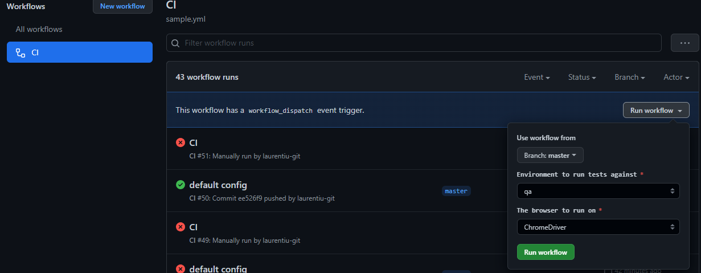

## Guide
For bugs tickets read Bugs.MD (even though I would not really call them bug tickets) and for the third exercise the response is in ThirdTest.MD

There is also another branch that I planned on using a different dependency injection, but I have not configured it entirely, though there are some samples in it.

## How To Run Tests

### Cucumber Plugin
Via terminal use the following:

For default browser driver `./gradlew cucumber` and for specific driver for example FireFox: `./gradlew cucumber -Dbrowser=FireFoxDriver`

### Junit

There is a TestRunner to be able to run cucumber tests as junit tests using the following command in terminal:`./gradlew test --tests *TestRunner`
or all tests with `./gradlew test` and if you want a specific browser add it as above

## From GitHub Actions
By triggering manually the CI workflow and selecting different configurations or using the default ones, though Firefox Driver needs more setup for tests

It was scheduled to run every 30 minutes, but I have removed it.

