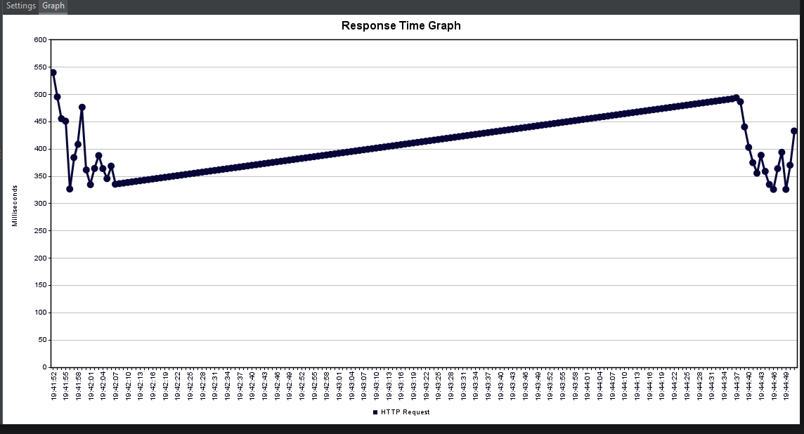
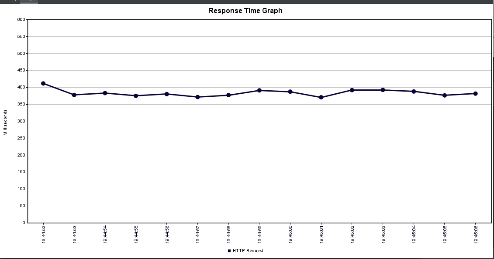

Checking how the web application will behave with 1000 intermittent users, the plan is to simulate many requests at the same time
on the same page.

Before the 1000 user test is running we have the following responses

The first request takes longer to process, might be due to tcp/caching 

And when the 1000 users test is running we have the following response, and we can see a more stable response time

● Did the load test have an impact on the web application response time?
Not really, seems to be a stable application.

● What is the optimal application response time for modern day web
applications?
Probably something under 1 second.